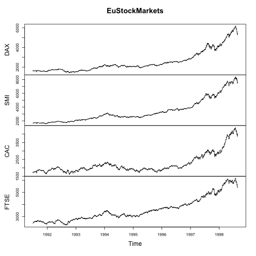

EU Stock Market App (1991-1998)
========================================================
author: Shyam Chander
date: 10th Feb 2016
autosize: true
font-import: http://fonts.googleapis.com/css?family=Roboto
font-family: 'Roboto'

App Details
========================================================

This application allows user to plot the EU Stock Market Daily end of maket trends by varying the year range and indices.

- Github repository: https://github.com/shyamchander/data-products-week4
- Shiny App Published: https://sichander.shinyapps.io/EuStockMarkets/

Source: The data were kindly provided by Erste Bank AG, Vienna, Austria.

Complete Dataset Summary
========================================================


```r
summary(EuStockMarkets)
```

```
      DAX            SMI            CAC            FTSE     
 Min.   :1402   Min.   :1587   Min.   :1611   Min.   :2281  
 1st Qu.:1744   1st Qu.:2166   1st Qu.:1875   1st Qu.:2843  
 Median :2141   Median :2796   Median :1992   Median :3247  
 Mean   :2531   Mean   :3376   Mean   :2228   Mean   :3566  
 3rd Qu.:2722   3rd Qu.:3812   3rd Qu.:2274   3rd Qu.:3994  
 Max.   :6186   Max.   :8412   Max.   :4388   Max.   :6179  
```

Complete Dataset Plot
========================================================



User Interactions 
========================================================

This application allows user to plot the EU Stock Market Daily end of maket trends by varying the year range and indices.

- User can select the indices to generate plot and summary for out of the available 4 indices (DAX,SMI,CAC,FTSE)
- User can select year range from within the dataset (1991-1998) and changes are reflected in the plots and summary
